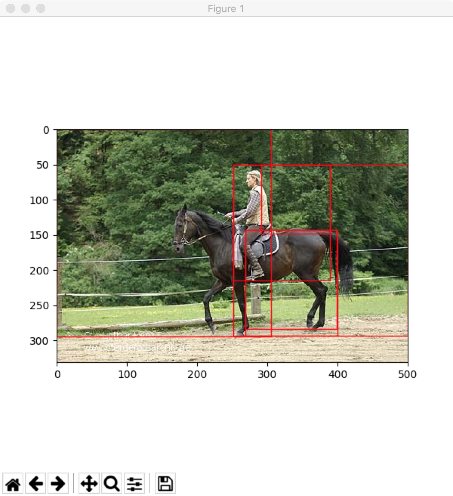

# selective-search
```
Selective Search for Object Recognition
J.R.R. Uijlings, K.E.A. van de Sande, T. Gevers, and A.W.M. Smeulders
Technical Report 2012, submitted to IJCV
```
# Usage

```
python selective-search.py sigma k min_size input_image_file output_image_file

ex)
python selective-search.py 0.8 300 50 lena.png haha.png

tip: For test, I use matplotlib to show the image with boxes instead of saving it.
```

# Result

 
